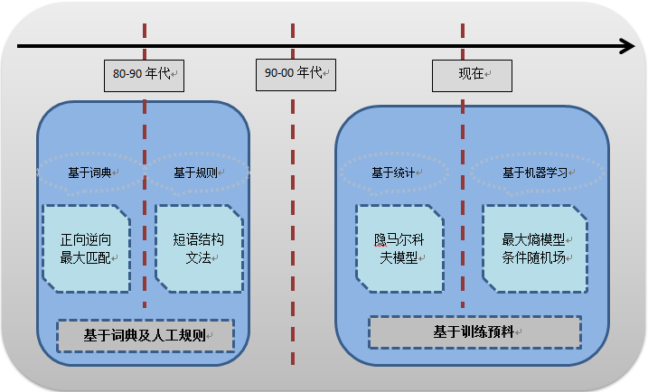
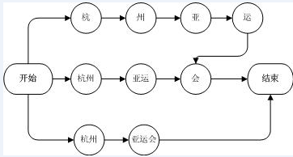
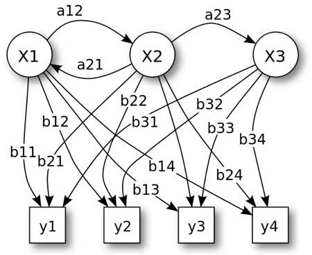
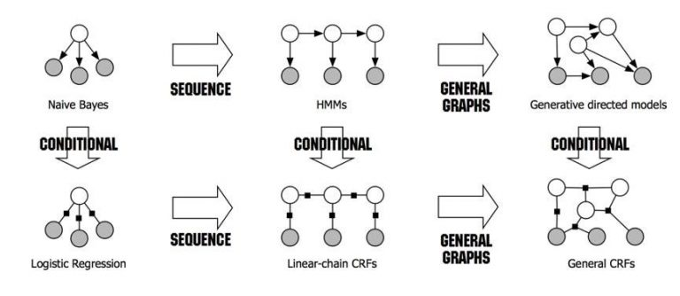

# 细说中文分词 [转载]

注：本文是转载，原作者的文章是：[标点符：细说中文分词](https://www.biaodianfu.com/chinese-segmenter.html) 。

## 1. 简介

完整的中文自然语言处理过程一般包括以下五种中文处理核心技术：分词、词性标注、命名实体识别、依存句法分析、语义分析。其中，分词是中文自然语言处理的基础，[搜素引擎](http://www.biaodianfu.com/elasticsearch-intro.html)、文本挖掘、机器翻译、关键词提取、[自动摘要](http://www.biaodianfu.com/automatic-text-summarizer.html)生成等等技术都会用到中文分词，包括最近在学习的[聊天机器人](http://www.biaodianfu.com/chatterbot.html)、[文本相似性](http://www.biaodianfu.com/simhash.html)等。可以说分词是自然语言大厦的地基，下面就让我们从它开始谈起。

## 2. 什么是中文分词

中文分词就是将中文语句中的词汇按照使用时的含义切分出来的过程，也就是将一个汉字序列切分成一个个有单独含义的词语。自20世纪80年代以来，中文自动分词就一直是一个研究热点，由于中文语言的复杂性使之一直处于发展阶段。目前，分词主要包含细粒度分词和粗粒度分词两种，在不同的应用场景需要用到不同的粒度。细粒度分词是指将原始语句切分成最基本的词语，而粗粒度分词是指将原始语句中的多个基本词组合起来切成一个词，进而组成语义相对明确的实体。

原始串：浙江大学坐落在西湖旁边

细粒度：浙江/大学/坐落/在/西湖/旁边

粗粒度：浙江大学/坐落/在/西湖/旁边

## 3. 为什么要中文分词

对于中文而言，词是承载语义的最小单元，由词构成语句，又由语句构成篇章。但是，中文文本是由连续的字序列构成，词与词之间是没有天然的分隔符。在自然语言处理领域，国外已经做出了很多卓有成效的研究，但是那些研究大多基于英文（存在天然的分隔符），也就是说是以正确切分出单词为前提的。于是，NLP对于中文而言要想取得较好的科研成果，就需要准确识别词与词之间的边界，也就是分词。

接下来我们就以搜索为例，具体的阐述一下分词的重要性与必要性。大家都知道，目前的搜素引擎是基于一种叫做倒排索引的结构，以什么作为索引的key值，直接影响到整个搜索引擎的准确度、召回率以及性能。

如果不使用中文分词，可以采用单个汉字索引方式。例如“[标点符](http://www.biaodianfu.com/)”，会先索引“标”字，再索引“点”字，再索引“符”字。搜索过程中，也是先寻找“标”字关联的所有文档，再寻找“点”字关联的所有文档，再寻找“符”字关联的所有文档，最后对所有被检索出的文档做“与”运算，同时“标点符”位置连续的文档才算符合要求。这种方式存在一个非常挑战性的问题，常用汉字总共3000左右，每次查询过程中进行“与”操作的计算量会相当大。对于大数据量的搜索引擎来讲，每天面临亿万级别的查询，这样的索引结构无疑是灾难性的。

为了优化上面提到的速度问题，还有另外一种索引结构也是可以避开中文分词的，那就是n元组合索引方式。用2元索引来说，“标点符”，会先索引“标点”，再索引“点符”。在搜索过程中，也是对“标点”和“点符”检索出的文章进行“与”运算。这样的搜索过程会大大减少在搜索过程中的计算量，但是仍会面临另外一个问题：准确度。有很多这样的例子，搜“北大”会检索出“东北大学”，搜“的士”会出现“不想当将军的士兵不是好士兵”。对于大数据量的搜索引擎系统来说，这样的用户体验是极差的。

## 4. 中文分词面临的挑战

在知道分词的重要性之后，那么我们会面临一个新的问题，如何才能把一个字序列准确的切分成词序列，就像下面的例子会有不止一种的切分方式。

原始字符串：结婚的和尚未结婚的

切分一：结婚/的/和尚/未/结婚/的

切分二：结婚/的/和/尚未/结婚/的

还有更极端的例子，“中外科学名著”中，“中外”、“外科”、科学”、“学名”、“名著”都是合理的词语。类似的例子数不胜数，“提高产品质量”，“鞭炮声响彻夜空”。在中文分词的世界里，最主要的挑战有两个：歧义词识别，未登录词识别。

### 4.1 歧义词

上文提到的歧义词例子，有学者试图通过逆向匹配来解决。但是，碰到这句“结合成分子”时，采用逆向匹配，则会分成“结合/成分/子时”。一般当一个字可以同时作为两个词的组成部分，当这两个词按序同时出现时，就可能会出现歧义现象。目前的歧义一般分为三种：交叉歧义，组合歧义，真歧义。

交叉歧义（字符串AJB，AJ和JB都是一个汉语词汇，会存在多种切分交叉在一起）：“你说的确实在理”，“的确”和“确实”就是交叉型歧义片段。

组合歧义（字符串AB是一个词汇，A和B同时也是词汇，会存在不同语义下切分不同）：“这个人手上有颗痣”，“目前人手紧缺”。前者是“人”/“手”两个实体词，后者是“人手”一个实体词。

真歧义（怎么切分都合理）：“乒乓球拍卖完了”，切分为以下两种情况都是合理的，“乒乓球拍/卖/完了”，“乒乓球/拍卖/完了”。

### 4.2 未登录词

所谓的未登录词是指在分词词典中没有收录，并且确实是大家公认的词语的那些词语，一般又叫做新词。最典型的未登录词就是人名词，“李胜利喜欢唱歌”中“李胜利”是个人名词，如果把“李胜利”这个基本词条收录到字典中去是能解决这个问题。但是，每时每刻都有新增的姓名，完整收录全部人名本身就是一个不现实的工程。中外人名、中国地名、机构组织名、事件名、货币名、缩略语、派生词、各种专业术语以及在不断发展和约定俗成的一些新词语。在当下的互联网时代，人们还会不断的创造出一些新词出来，比如：“神马”、“不明觉厉”等。未登录词辨别未登录词包括是种类繁多，形态组合各异，规模宏大的一个领域。对这些词语的自动辨识，是一件非常困难的事。

新词是中文分词算法在召回层面上最主要的难题，也是评价一个分词系统好坏的重要标志。如果一个新词无法被分词系统识别，会导致很多噪音数据被召回，进而会影响后面的句法分析和语义分析等相关处理。黄昌宁等在中文信息学报上的《中文分词十年回顾》一文指出：新词带来的分词问题是歧义的10倍~20倍，所以说新词发现是分词面临的最大挑战。

## 5. 中文分词的技术分类

从上世纪80年代开始对中文自动分词进行研究，在过去的近40年中，中文分词的发展过程基本上可分为以下三个阶段，如下图所示：



我们讨论的分词算法可分为三大类：

  * 基于词典：基于字典、词库匹配的分词方法；（字符串匹配、机械分词法）
  * 基于统计：基于词频度统计的分词方法
  * 基于规则：基于知识理解的分词方法

### 5.1 基于词典的分词

中文自动分词第一阶段，从80年代到90年代中，以基于词典和人工规则的方法为主，典型的方法有：正向最大匹配，逆向最大匹配，最少词切分法，双向匹配法。这种方法又叫做机械分词方法，它是按照一定的策略将待分析的汉字串与一个“充分大的”机器词典中的词条进行配，若在词典中找到某个字符串，则匹配成功（识别出一个词）。按照扫描方向的不同，串匹配分词方法可以分为正向匹配和逆向匹配；按照不同长度优先匹配的情况，可以分为最大（最长）匹配和最小（最短）匹配；常用的几种机械分词方法如下：

### **最大正向匹配法(MM, Maximum Matching Method, MM)**

通常简称为MM法。其基本思想为：假定分词词典中的最长词有i个汉字字符，则用被处理文档的当前字串中的前i个字作为匹配字段，查找字典。若字典中存在这样的一个i字词，则匹配成功，匹配字段被作为一个词切分出来。如果词典中找不到这样的一个i字词，则匹配失败，将匹配字段中的最后一个字去掉，对剩下的字串重新进行匹配处理…… 如此进行下去，直到匹配成功，即切分出一个词或剩余字串的长度为零为止。这样就完成了一轮匹配，然后取下一个i字字串进行匹配处理，直到文档被扫描完为止。其算法描述如下：

从左向右取待切分汉语句的m个字符作为匹配字段，m为大机器词典中最长词条个数。

查找大机器词典并进行匹配。若匹配成功，则将这个匹配字段作为一个词切分出来。若匹配不成功，则将这个匹配字段的最后一个字去掉，剩下的字符串作为新的匹配字段，进行再次匹配，重复以上过程，直到切分出所有词为止。

举个例子：我们对“南京市长江大桥”这个句子进行分词，根据正向最大匹配的原则。先从句子中拿出前5个字符“南京市长江”，把这5个字符到词典中匹配，发现没有这个词，那就缩短取字个数，取前四个“南京市长”，发现词库有这个词，就把该词切下来；对剩余三个字“江大桥”再次进行正向最大匹配，会切成“江/大桥”；整个句子切分完成为：“京市长/江/大桥。”

#### **逆向最大匹配法(Reverse Maximum Matching Method, RMM)**

通常简称为RMM法。RMM法的基本原理与MM法相同 ,不同的是分词切分的方向与MM法相反，而且使用的分词辞典也不同。逆向最大匹配法从被处理文档的末端开始匹配扫描，每次取最末端的2i个字符（i字字串）作为匹配字段，若匹配失败，则去掉匹配字段最前面的一个字，继续匹配。相应地，它使用的分词词典是逆序词典，其中的每个词条都将按逆序方式存放。在实际处理时，先将文档进行倒排处理，生成逆序文档。然后，根据逆序词典，对逆序文档用正向最大匹配法处理即可。

还是那个例子：取出“南京市长江大桥”的后四个字“长江大桥”，发现词典中有匹配，切割下来；对剩余的“南京市”进行分词，整体结果为：“南京市/江大桥”

由于汉语中偏正结构较多，若从后向前匹配，可以适当提高精确度。所以，逆向最大匹配法比正向最大匹配法的误差要小。统计结果表明，单纯使用正向最大匹配的错误率为1/169，单纯使用逆向最大匹配的错误率为1/245。

例如切分字段“硕士研究生产”，正向最大匹配法的结果会是“硕士研究生/产”，而逆向最大匹配法利用逆向扫描，可得到正确的分词结果“硕士/研究/生产”。但这种精度还远远不能满足实际的需要。实际使用的分词系统，都是把机械分词作为一种初分手段，还需通过利用各种其它的语言信息来进一步提高切分的准确率。

#### **双向最大匹配法(Bi-directction Matching method, BM)**

双向最大匹配法是将正向最大匹配法得到的分词结果和逆向最大匹配法的到的结果进行比较，从而决定正确的分词方法。据SunM.S. 和 Benjamin K.T.（1995）的研究表明，中文中90.0%左右的句子，正向最大匹配法和逆向最大匹配法完全重合且正确，只有大概9.0%的句子两种切分方法得到的结果不一样，但其中必有一个是正确的（歧义检测成功），只有不到1.0%的句子，或者正向最大匹配法和逆向最大匹配法的切分虽重合却是错的，或者正向最大匹配法和逆向最大匹配法切分不同但两个都不对（歧义检测失败）。这正是双向最大匹配法在实用中文信息处理系统中得以广泛使用的原因所在。

还是那个例子：双向的最大匹配，即把所有可能的最大词都分出来，上面的句子可以分为：南京市、南京市长、长江大桥、江、大桥

#### **最少切分法**

使每一句中切出的词数最小。

由于汉语单字成词的特点，正向最小匹配和逆向最小匹配一般很少使用。一般说来，逆向匹配的切分精度略高于正向匹配，遇到的歧义现象也较少。

基于词典分词这类算法优点是速度块，都是O(n)时间复杂度，实现简单，效果尚可。但也有缺点，这种基于规则的机械匹配法缺乏歧义切分处理，上面提到的几种切分方法是从不同的角度来处理歧义问题，但是任何一种方法只能解决有限类别的歧义问题。随着词典的增大，词与词之间的交叉会变得更加严重，歧义带来的负面影响会更加严重。同时，基于规则的切分方法对于新词的切分是完全无能为力的。

#### 基于统计的分词法

中文自动分词第二阶段，从90年代中到03年，分词算法开始引入基于语料库的统计学习方法，最典型的方法就是基于词典全切分加上最大概率路径。首先，介绍一下全切分方法，它是基于词的频度统计的分词方法的基础。全切分顾名思义就是获取原字序列的所有可能成词的切分结果，这样就不会遗漏可能正确的切分方式。所以建立在部分切分基础上的分词方法不管采取何种歧义纠正策略，都可能会遗漏正确的切分，造成分词错误或失败。而建立在全切分基础上的分词方法，由于全切分取得了所有可能的切分形式，因而从根本上避免了可能切分形式的遗漏，克服了部分切分方法的缺陷。

将全切分的结构构件一个有向无环图，比如“杭州亚运会”的全切分有向无环图如下所示。



构成有向无环图之后，在此图中找到一条概率最大的路径，使用的是**N元文法模型（N-gram）**模型，该模型基于这样一种假设，第n个词的出现只与前面N-1个词相关，而与其它任何词都不相关，整句的概率就是各个词出现概率的乘积。我们给定一个词，然后猜测下一个词是什么。当我说“艳照门”这个词时，你想到下一个词是什么呢？我想大家很有可能会想到“陈冠希”，N-gram模型的主要思想就是这样的。


其中，w值是指用全切分方法切分出来的词语。基于全切分最大概率路径的切分算法也是需要依赖词典，全切分在实际使用过程，一般会通过词典将所有成词的切分方式找出来构成有向无环图。第一阶段的中文分词相比，它也是无法完成识别新词，但是歧义词识别的问题基本被解决。在实际使用的工业分词系统中，词典中的词一般会带有词频属性。同时，还会有一份词与词之间的跳转频率表，最大概率的计算往往是基于词频和词之间的跳转频率进行的。

全切分算法能取得所有可能的切分形式，它的句子覆盖率和分词覆盖率均为100%，但全切分分词并没有在文本处理中广泛地采用，原因有以下几点：

全切分算法只是能获得正确分词的前提，因为全切分不具有歧义检测功能，最终分词结果的正确性和完全性依赖于独立的歧义处理方法，如果评测有误，也会造成错误的结果。

全切分的切分结果个数随句子长度的增长呈指数增长，一方面将导致庞大的无用数据充斥于存储数据库；另一方面当句长达到一定长度后，由于切分形式过多,造成分词效率严重下降。

#### 基于规则的分词法

从03年至今，中文分词由基于词的方法开始向基于字的方法转变。当前的方法都是首先根据语料训练分词模型，然后对每一个字进行标注，最后根据标注结果来进行分词。其实就是根据语料训练分类模型，对每一个字进行类别标注，最后根据类别进行分词。这类分词基于人工标注的词性和统计特征，对中文进行建模，即根据观测到的数据（标注好的语料）对模型参数进行估计，即训练。在分词阶段再通过模型计算各种分词出现的概率，将概率最大的分词结果作为最终结果。这类分词算法能很好处理歧义和未登录词问题，效果比前一类效果好，但是需要大量的人工标注数据，以及较慢的分词速度。最典型的方法就是HMM和CRF，其中，CRF比HMM有更弱的上下文无关性假设，当然效果要好一些。

#### **隐马尔科夫模型(Hidden Markov Model, HMM)**

全切分这种方法存在两个致命的缺陷：一个缺陷是参数空间过大，不可能实用化；另外一个缺陷是数据稀疏严重。为了解决这个问题，我们引入了马尔科夫假设：一个词的出现仅仅依赖于它前面出现的有限的一个或者几个词。如果一个词的出现仅依赖于它前面出现的一个词，那么我们就称之为bigram。即

$$
\begin{aligned}
& P(T) = P(W1W2W3…Wn) \\
& = P(W1)P(W2|W1)P(W3|W1W2)…P(Wn|W1W2…Wn-1) \\
& ≈ P(W1)P(W2|W1)P(W3|W2)…P(Wn|Wn-1)
\end{aligned}
$$

如果一个词的出现仅依赖于它前面出现的两个词，那么我们就称之为trigram。在实践中用的最多的就是bigram和trigram了，而且效果很不错。高于四元的用的很少，因为训练它需要更庞大的语料，而且数据稀疏严重，时间复杂度高，精度却提高的不多。一般的小公司，用到二元的模型就够了，像Google这种巨头，也只是用到了大约四元的程度，它对计算能力和空间的需求都太大了。

设 $w1,w2,w3,…,wn$ 是长度为n的字符串，规定任意词 $wi$ 只与它的前两个相关，得到三元概率模型。以此类推，N元模型就是假设当前词的出现概率只同它前面的N-1个词有关。这是一种全切分方法。它不依靠词典,而是将文章中任意两个字同时出现的频率进行统计，次数越高的就可能是一个词。它首先切分出与词表匹配的所有可能的词，运用统计语言模型和决策算法决定最优的切分结果。它的优点在于可以发现所有的切分歧义并且容易将新词提取出来。



#### **HMM 模型介绍**

HMM的典型介绍就是这个模型是一个五元组:

StatusSet: 状态值集合

ObservedSet: 观察值集合

TransProbMatrix: 转移概率矩阵

EmitProbMatrix: 发射概率矩阵

InitStatus: 初始状态分布

HMM模型可以用来解决三种问题：

参数(StatusSet, TransProbMatrix, EmitRobMatrix, InitStatus)已知的情况下，求解观察值序列。(Forward-backward算法)

参数(ObservedSet, TransProbMatrix, EmitRobMatrix, InitStatus)已知的情况下，求解状态值序列。(viterbi算法)

参数(ObservedSet)已知的情况下，求解(TransProbMatrix, EmitRobMatrix, InitStatus)。(Baum-Welch算法)

其中，第三种问题最玄乎也最不常用，第二种问题最常用，中文分词、语音识别、新词发现、词性标注都有它的一席之地。这里主要介绍第二种问题，即viterbi算法求解状态值序列的方法。

五元组参数在中文分词中的具体含义：

**StatusSet & ObservedSet**

状态值集合为 $(B, M, E, S): \{B:begin, M:middle, E:end, S:single\}$ 。分别代表每个状态代表的是该字在词语中的位置，B代表该字是词语中的起始字，M代表是词语中的中间字，E代表是词语中的结束字，S则代表是单字成词。观察值集合为就是所有汉字，甚至包括标点符号所组成的集合。

状态值也就是我们要求的值，在HMM模型中文分词中，我们的输入是一个句子(也就是观察值序列)，输出是这个句子中每个字的状态值。

比如：小明硕士毕业于中国科学院计算所

输出的状态序列为：BEBEBMEBEBMEBES

根据这个状态序列我们可以进行切词：BE/BE/BME/BE/BME/BE/S

所以切词结果如下：小明/硕士/毕业于/中国/科学院/计算/所

同时我们可以注意到：B后面只可能接(M or E)，不可能接(B or S)。而M后面也只可能接(M or E)，不可能接(B, S)。

上文只介绍了五元组中的两元StatusSet、ObservedSet，下文介绍剩下的三元InitStatus、TransProbMatrix、EmitProbMatrix。这五元的关系是通过一个叫Viterbi的算法串接起来，ObservedSet序列值是Viterbi的输入， 而StatusSet序列值是Viterbi的输出，输入和输出之间Viterbi算法还需要借助三个模型参数，分别是InitStatus, TransProbMatrix, EmitProbMatrix。

**InitStatus**

初始状态概率分布是最好理解的，可以示例如下：

```
#B
-0.26268660809250016
#E
-3.14e+100
#M
-3.14e+100
#S
-1.4652633398537678
```

示例数值是对概率值取对数之后的结果(可以让概率相乘的计算变成对数相加)，其中-3.14e+100作为负无穷，也就是对应的概率值是0。也就是句子的第一个字属于{B,E,M,S}这四种状态的概率，如上可以看出，E和M的概率都是0，这和实际相符合，开头的第一个字只可能是词语的首字(B)，或者是单字成词(S)。

**TransProbMatrix**

转移概率是马尔科夫链很重要的一个知识点，大学里面学过概率论的人都知道，马尔科夫链最大的特点就是当前 $T=i$ 时刻的状态Status(i)，只和 $T=i$ 时刻之前的n个状态有关。也就是：${Status(i-1), Status(i-2), Status(i-3), … Status(i – n)}$ 。更进一步的说，HMM模型有三个基本假设作为模型的前提，其中有个有限历史性假设，也就是马尔科夫链的n=1。即 $Status(i)$ 只和 $Status(i-1)$ 相关，这个假设能大大简化问题。

回过头看TransProbMatrix，其实就是一个4×4(4就是状态值集合的大小)的二维矩阵，示例如下：

矩阵的横坐标和纵坐标顺序是BEMS x BEMS

```
-3.14e+100 -0.510825623765990 -0.916290731874155 -3.14e+100
-0.5897149736854513 -3.14e+100 -3.14e+100 -0.8085250474669937
-3.14e+100 -0.33344856811948514 -1.2603623820268226 -3.14e+100
-0.7211965654669841 -3.14e+100 -3.14e+100 -0.6658631448798212
```

比如TransProbMatrix[0][0]代表的含义就是从状态B转移到状态B的概率，由 TransProbMatrix[0][0] =-3.14e+100可知，这个转移概率是0，这符合常理。由状态各自的含义可知，状态B的下一个状态只可能是ME，不可能是BS，所以不可能的转移对应的概率都是0，也就是对数值负无穷，在此记为-3.14e+100。

由上TransProbMatrix矩阵可知，对于各个状态可能转移的下一状态，且转移概率对应如下：

```
#B
#E:-0.510825623765990,M:-0.916290731874155
#E
#B:-0.5897149736854513,S:-0.8085250474669937
#M
#E:-0.33344856811948514,M:-1.2603623820268226
#S
#B:-0.7211965654669841,S:-0.6658631448798212
```

**EmitProbMatrix**

这里的发射概率(EmitProb)其实也是一个条件概率而已，根据HMM模型三个基本假设里的观察值独立性假设，观察值只取决于当前状态值，也就是：

$P(Observed[i], Status[j]) = P(Status[j]) * P(Observed[i]|Status[j])$ 。

其中 $P(Observed[i]|Status[j])$ 这个值就是从EmitProbMatrix中获取。

EmitProbMatrix示例如下：

```
#B
耀:-10.460283,涉:-8.766406,谈:-8.039065,伊:-7.682602,洞:-8.668696,...
#E
耀:-9.266706,涉:-9.096474,谈:-8.435707,伊:-10.223786,洞:-8.366213,...
#M
耀:-8.47651,涉:-10.560093,谈:-8.345223,伊:-8.021847,洞:-9.547990,....
#S
蘄:-10.005820,涉:-10.523076,唎:-15.269250,禑:-17.215160,洞:-8.369527...
```

虽然EmitProbMatrix也称为矩阵，这个矩阵太稀疏了，实际工程中一般是将上面四行发射转移概率存储为4个Map，详见代码[HMMSegment](https://github.com/yanyiwu/cppjieba/blob/master/src/HMMSegment.hpp)。

到此，已经介绍完HMM模型的五元参数，假设现在手头上已经有这些参数的具体概率值，并且已经加载进来，(也就是有该模型的字典了，详见[HMMDict](https://github.com/yanyiwu/cppjieba/tree/master/dict)里面的hmm_model.utf8)，那么我们只剩下Viterbi这个算法函数，这个模型就算可以开始使用了。所以接下来讲讲Viterbi算法。

#### **Viterbi 算法**

输入样例：小明硕士毕业于中国科学院计算所

Viterbi算法计算过程如下：

1、定义变量

二维数组 weight[4][15]，4是状态数(0:B,1:E,2:M,3:S)，15是输入句子的字数。比如 weight[0][2] 代表 状态B的条件下，出现’硕’这个字的可能性。

二维数组 path[4][15]，4是状态数(0:B,1:E,2:M,3:S)，15是输入句子的字数。比如 path[0][2] 代表 weight[0][2]取到最大时，前一个字的状态，比如 path[0][2] = 1, 则代表 weight[0][2]取到最大时，前一个字(也就是明)的状态是E。记录前一个字的状态是为了使用viterbi算法计算完整个 weight[4][15] 之后，能对输入句子从右向左地回溯回来，找出对应的状态序列。

2、使用InitStatus对weight二维数组进行初始化

已知InitStatus如下:

```
#B
-0.26268660809250016
#E
-3.14e+100
#M
-3.14e+100
#S
-1.4652633398537678
```

且由EmitProbMatrix可以得出

```
Status(B) -> Observed(小)  :  -5.79545
Status(E) -> Observed(小)  :  -7.36797
Status(M) -> Observed(小)  :  -5.09518
Status(S) -> Observed(小)  :  -6.2475
```

所以可以初始化 weight[i][0] 的值如下：

```
1
2
3
4
weight[0][0] = -0.26268660809250016 + -5.79545 = -6.05814
weight[1][0] = -3.14e+100 + -7.36797 = -3.14e+100
weight[2][0] = -3.14e+100 + -5.09518 = -3.14e+100
weight[3][0] = -1.4652633398537678 + -6.2475 = -7.71276
```

注意上式计算的时候是相加而不是相乘，因为之前取过对数的原因。

3、遍历句子计算整个weight二维数组

```c
// 遍历句子，下标i从1开始是因为刚才初始化的时候已经对0初始化结束了
for (size_t i = 1; i < 15; i++)
{
    // 遍历可能的状态
    for (size_t j = 0; j < 4; j++) 
    {
        weight[j][i] = MIN_DOUBLE;
        path[j][i] = -1;
        // 遍历前一个字可能的状态
        for (size_t k = 0; k < 4; k++)
        {
            double tmp = weight[k][i-1] + _transProb[k][j] + _emitProb[j][sentence[i]];
            if (tmp > weight[j][i]) // 找出最大的weight[j][i]值
            {
                weight[j][i] = tmp;
                path[j][i] = k;
            }
        }
    }
}
```

如此遍历下来，weight[4][15] 和 path[4][15] 就都计算完毕。

4、确定边界条件和路径回溯

边界条件如下：对于每个句子，最后一个字的状态只可能是 E 或者 S，不可能是 M 或者 B。

所以在本文的例子中我们只需要比较 weight[1(E)][14] 和 weight[3(S)][14] 的大小即可。在本例中：

```c
weight[1][14] = -102.492;
weight[3][14] = -101.632;
```

所以 S > E，也就是对于路径回溯的起点是 path[3][14]。

回溯的路径是：SEBEMBEBEMBEBEB

倒序一下就是：BE/BE/BME/BE/BME/BE/S

切词结果就是：小明/硕士/毕业于/中国/科学院/计算/所

到此，一个HMM模型中文分词算法过程就阐述完毕了。也就是给定我们一个模型，我们对模型进行载入完毕之后，只要运行一遍Viterbi算法，就可以找出每个字对应的状态，根据状态也就可以对句子进行分词。

模型的训练问题

以上讲的前提是基于模型来进行切词，也就是假设我们手头上的HMM模型已经是被训练好了的(也就是InitStatus, TransProbMatrix, EmitProbMatrix这三个模型的关键参数都是已知的)，没有涉及到这三个参数是如何得到的。 这三个参数其实也是基于已分词完毕的语料进行统计计算，计算出相应的频率和条件概率就可以算出这三个参数。

HMM模型的三个基本假设如下：

有限历史性假设：

$$P(Status[i]|Status[i-1],Status[i-2],… Status[1]) = P(Status[i]|Status[i-1])$$

齐次性假设(状态和当前时刻无关)：

$$P(Status[i]|Status[i-1]) = P(Status[j]|Status[j-1])$$

观察值独立性假设(观察值只取决于当前状态值)：

$$P(Observed[i]|Status[i],Status[i-1],…,Status[1]) = P(Observed[i]|Status[i])$$

**条件随机场（Conditional Random Field，CRF）**

2001年Lafferty在最大熵模型（MEM）和隐马尔科夫模型（HMM）的基础上提出来了一种无向图模型–条件随机场（CRF）模型，它能在给定需要标记的观察序列的条件下，最大程度提高标记序列的联合概率。常用于切分和标注序列化数据的统计模型。

CRF（Conditionalrandom field，条件随机场）是用来标注和划分结构数据的概率化结构模型，通常使用在模式识别和机器学习中，在自然语言处理和图像处理等领域中得到广泛应用。和HMM类似，当对于给定的输入观测序列X和输出序列Y，CRF通过定义条件概率 $P(Y|X)$ ，而不是联合概率分布 $P(X，Y)$ 来描述模型。CRF算法的具体算法可以参考[维基百科词条](https://en.wikipedia.org/wiki/Conditional_random_field)。



不同概率模型之间的关系及演化图

以CRF为例，它把分词看作是对一个字序列进行标注的过程，一般会标记为4种状态：词首(B)、词中(M)、词尾(E)、单独成词(S)。例如，对于一个输入序列“我来到网易杭州研究院”会标记为“我/S 来/B 到/E 网/B 易/E 杭/B 州/E 研/B 究/M 院/E”，根据标注结果就得到最终的分词结果。CRF模型的最优函数形式如下所示：


其中，Z是归一化函数，f是特征函数，前面是特征对应的权重。CRF分词的过程就是找到一个标注序列使得其最优函数达到最大值。由于CRF模型不是基于词典的，可以有效的识别新词。同时，其分词的准确率也已经达到工业界使用的要求。但是，CRF分词的效率和一致性会存在一定问题。一致性问题是指同一个待切分片段会随着上下文的不同可能做成完全不同的切分结果，所以在搜索业务中在召回层面使用是不合适的。当前CRF的主流用法是在线进行人名识别和歧义片段解析，并使用词典来保持分词结果的一致性，以及离线识别新词补充至词典。

在实际应用中有很多工具包可以使用，比如CRF++，CRFsuite，SGD，Wapiti 等，其中CRF++的准确度较高。在分词中使用CRF++时，主要的工作是特征模板的配置。CRF++支持unigram，bigram两种特征，分别以U和B开头。举例来讲U00：%x[-2，0]表示第一个特征，特征取值是当前字的前方第二个字，U01：%x[-1，0]表示第二个特征，特征取值当前字前一个字，U02：%x[0，0]表示第三个特征，取当前字，以此类推。特征模板可以支持多种特征，CRF++会根据特征模板提取特征函数，用于模型的建立和使用。特征模板的设计对分词效果及训练时间影响较大，需要分析尝试找到适用的特征模板。

## 6. 常见中文分词工具

### 6.1 结巴中文分词

结巴中文分词采用的算法

基于Trie树结构实现高效的词图扫描，生成句子中汉字所有可能成词情况所构成的有向无环图（DAG)

采用了动态规划查找最大概率路径, 找出基于词频的最大切分组合

对于未登录词，采用了基于汉字成词能力的HMM模型，使用了Viterbi算法

目前结巴分词支持三种分词模式：

精确模式，试图将句子最精确地切开，适合文本分析；

全模式，把句子中所有的可以成词的词语都扫描出来, 速度非常快，但是不能解决歧义；

搜索引擎模式，在精确模式的基础上，对长词再次切分，提高召回率，适合用于搜索引擎分词。

项目地址：

Python版本：[https://github.com/fxsjy/jieba](https://github.com/fxsjy/jieba)

### 6.2 IK分词器

IKAnalyzer是一个开源的，基于java语言开发的轻量级的中文分词工具包。从2006年12月推出1.0版开始，IKAnalyzer已经推出了3个大版本。最初，它是以开源项目Luence为应用主体的，结合词典分词和文法分析算法的中文分词组件。新版本的 IKAnalyzer3.0则发展为面向Java的公用分词组件，独立于Lucene项目，同时提供了对Lucene的默认优化实现。

IKAnalyzer采用的算法：

正向迭代最细粒度切分算法

针对Lucene全文检索优化的查询分析器IKQueryParser，引入简单搜索表达式，采用歧义分析算法优化查询关键字的搜索排列组合，能极大的提高Lucene检索的命中率。

IKAnalyzer支持的分词模式：

支持细粒度和最大词长两种切分模式

项目地址：

  * [https://github.com/wks/ik-analyze](https://github.com/wks/ik-analyze)

  * [https://github.com/medcl/elasticsearch-analysis-ik](https://github.com/medcl/elasticsearch-analysis-ik)

  * [https://github.com/quentinxxz/Search](https://github.com/quentinxxz/Search)（源码保存）

### 6.3 中科院NLPIR分词（ICTCLAS）

NLPIR分词系统前身为2000年发布的ICTCLAS词法分析系统，从2009年开始，为了和以前工作进行大的区隔，并推广NLPIR自然语言处理与信息检索共享平台，调整命名为NLPIR分词系统。NLPIR支持的功能：全文精准检索、新词发现、分词标注、统计分析与术语翻译、大数据聚类及热点分析、大数据分类过滤、自动摘要、关键词提取、文档去重、HTML正文提取、编码自动识别与转换等。

NLPIR使用的算法：

基于HMM的分词库

项目地址：

  * [http://ictclas.nlpir.org/](http://ictclas.nlpir.org/)

  * [https://github.com/NLPIR-team/NLPIR](https://github.com/NLPIR-team/NLPIR)

### 6.4 Ansj中文分词

Ansj 是一个开源的 Java 中文分词工具，基于中科院的 ictclas 中文分词算法。目前实现了中文分词、中文姓名识别、用户自定义词典、关键字提取、自动摘要、关键字标记等功能。

Ansj使用的算法：

n-Gram+CRF+HMM

分词效果速度都超过开源版的ICTCLAS

项目地址：[https://github.com/NLPchina/ansj_seg](https://github.com/NLPchina/ansj_seg)

### 6.5 MMSEG分词

MMSeg是蔡志浩（Chih-Hao Tsai）提出的基于字符串匹配的中文分词算法。以正向最大匹配为主，多种消除歧义的规则为辅。根据作者在原文中的阐述，对MMSEG的解释分为“匹配算法（Matching algorithm）”和“消除歧义的规则（Ambiguity resolution rules）”这两部分。“匹配算法”是说如何根据词典里保存的词语，对要切分的语句进行匹配；“消除歧义的规则”是说当一句话可以这样分，也可以那样分的时候，用什么规则来判定使用哪中分法，比如“设施和服务”这个短语，可以分成“设施/和服/务”，也可以分成“设施/和/服务”，选择哪个分词结果，就是“消除歧义的规则”的功能。

MMSeg的字符串匹配算法分为两种：

Simple，简单的正向最大匹配，即按能匹配上的最长词做切分；

Complex，在正向最大匹配的基础上，考虑相邻词的词长，设计了四个去歧义规则（Ambiguity Resolution Rules）指导分词。

在complex分词算法中，MMSeg将切分的相邻三个词作为词块（chunk），应用如下四个歧义规则：

备选词块的长度最大（Maximum matching），即三个词的词长之和最大；

备选词块的平均词长最大（Largest average word length），即要求词长分布尽可能均匀；

备选词块的词长变化最小（Smallest variance of word lengths ）；

备选词块中（若有）单字的出现词自由度最高（Largest sum of degree of morphemic freedom of one-character words）。

这个四个过滤规则中，如果使用simple的匹配方法，只能使用第一个规则过滤，如果使用complex的匹配方法，则四个规则都可以使用。实际使用中，一般都是使用complex的匹配方法＋四个规则过滤。

项目地址：

[http://technology.chtsai.org/mmseg/](http://technology.chtsai.org/mmseg/)

### 6.6 **MMSeg 算法说明**

首先来理解一下chunk，它是MMSeg分词算法中一个关键的概念。Chunk中包含依据上下文分出的一组词和相关的属性，包括长度(Length)、平均长度(Average Length)、标准差的平方(Variance)和自由语素度(Degree Of Morphemic Freedom)。下面列出了这4个属性：

长度(Length)：chuck中各个词的长度之和

平均长度(Average Length)：长度(Length)/词数

标准差的平方(Variance)：同数学中的定义

自由语素度(Degree Of Morphemic Freedom)：各单字词词频的对数之和

Chunk中的4个属性只有在需要该属性的值时才进行计算，而且只计算一次。

其次来理解一下规则(Rule)，它是MMSeg分词算法中的又一个关键的概念。实际上我们可以将规则理解为一个过滤器(Filter)，过滤掉不符合要求的chunk。MMSeg分词算法中涉及了4个规则：

规则1：取最大匹配的chunk (Rule 1: Maximum matching)

规则2：取平均词长最大的chunk (Rule 2: Largest average word length)

规则3：取词长标准差最小的chunk (Rule 3: Smallest variance of word lengths)

规则4：取单字词自由语素度之和最大的chunk (Rule 4: Largest sum of degree of morphemic freedom of one-character words)

这4个规则符合汉语成词的基本习惯。

再来理解一下匹配方式复杂最大匹配(Complex maximum matching)：复杂最大匹配先使用规则1来过滤chunks，如果过滤后的结果多于或等于2，则使用规则2继续过滤，否则终止过滤过程。如果使用规则2得到的过滤结果多于或等于2，则使用规则3继续过滤，否则终止过滤过程。如果使用规则3得到的过滤结果多于或等于2，则使用规则4继续过滤，否则终止过滤过程。如果使用规则 4得到的过滤结果多于或等于2，则抛出一个表示歧义的异常，否则终止过滤过程。

最后通过一个例句–“研究生命起源”来简述一下复杂最大匹配的分词过程。MMSeg分词算法会得到7个chunk，分别为：

```
编号    chunk   长度
0   研_究_生    3
1   研_究_生命  4
2   研究_生_命  4
3   研究_生命_起    5
4   研究_生命_起源  6
5   研究生_命_起    5
6   研究生_命_起源  6
```

使用规则1过滤后得到2个chunk，如下：

```
编号    chunk   长度
4   研究_生命_起源  6
6   研究生_命_起源  6
```

计算平均长度后为：

```
编号    chunk   长度    平均长度
4   研究_生命_起源  6   2
6   研究生_命_起源  6   2
```

使用规则2过滤后得到2个chunk，如下：

```
编号    chunk   长度    平均长度
4   研究_生命_起源  6   2
6   研究生_命_起源  6   2
```

计算标准差的平方后为：

```
编号    chunk   长度    平均长度    标准差的平方
4   研究_生命_起源  6   2   0
6   研究生_命_起源  6   2   4/9
```

使用规则3过滤后得到1个chunk，如下：

```
编号    chunk   长度    平均长度    标准差的平方
4   研究_生命_起源  6   2   0
```

匹配过程终止。最终取“研究”成词，以相同的方法继续处理“生命起源”。

分词效果:

```
研究_生命_起源_
```

## 7. 其他分词工具

  * 清华大学THULAC（CRF）：[http://thulac.thunlp.org/](http://thulac.thunlp.org/)

  * 哈工大LTP（CRF）：[https://github.com/HIT-SCIR/ltp](https://github.com/HIT-SCIR/ltp)

  * 哈工大语言云（基于LTP）：[http://www.ltp-cloud.com/](http://www.ltp-cloud.com/)

  * 复旦大学NLP：[https://github.com/FudanNLP/fnlp](https://github.com/FudanNLP/fnlp)

  * 斯坦福大学（CRF）：[http://nlp.stanford.edu/software/segmenter.shtml](http://nlp.stanford.edu/software/segmenter.shtml)

  * scws(词频)：[https://github.com/hightman/scws](https://github.com/hightman/scws)

  * 庖丁（词库）：[https://github.com/cslinmiso/paoding-analysis](https://github.com/cslinmiso/paoding-analysis)

  * bamboo（CRF）：[https://github.com/zhuomingliang/nlpbamboo](https://github.com/zhuomingliang/nlpbamboo)

  * PullWord：[http://www.pullword.com/](http://www.pullword.com/)

  * 盘古分词：[http://pangusegment.codeplex.com/](http://pangusegment.codeplex.com/)

  * BosonNLP：[http://bosonnlp.com/](http://bosonnlp.com/dev/center)

  * 搜狗分词：http://www.sogou.com/labs/webservice/

  * 腾讯文智：[http://www.qcloud.com/wiki/API%E8%AF%B4%E6%98%8E%E6%96%87%E6%A1%A3](http://www.qcloud.com/wiki/API%E8%AF%B4%E6%98%8E%E6%96%87%E6%A1%A3)

  * 新浪云：[http://www.sinacloud.com/doc/sae/python/segment.html](http://www.sinacloud.com/doc/sae/python/segment.html)

  * HanLP：[https://github.com/hankcs/HanLP](https://github.com/hankcs/HanLP)

## 8. 中文分词使用案例

考拉海淘

目前考拉海淘使用的分词是基于ansj开源分词进行二次开发的版本，目的是优化ansj原有的分词策略以及增加适合电商的策略。

**召回问题**

通过日志以及用户反馈，我们发现对于同一商品往往存在不同表述，这可能会导致某种描述无法召回结果。例如，对于商品“扫地机器人”来说，有人会用“扫地机器”这样的query去查询，也有人会用“扫地机”去查询。但是按照最大概率路径分词策略，会把商品切分成”扫地”和”机器人”来进行建立索引。为了保证召回的准确性，底层NDIR是采用全匹配的方式来进行召回，也就是query中的所有词都必须出现在同一个文档中。对于上面的两种query，分词结果分别是“扫地/机器”，“扫地/机”，自然就无法召回用户所希望的商品。我们采用多路径切分的方式，来保证所有在词典的词语都出现在路径中，同时，对所有的路径进行索引建立。我们会把“扫地机器人”切分成“扫地/机器人”、“扫地/机器/人”、“扫地机/器/人”三条路径，这样就解决了无法召回的问题。

**词性问题**

当用户输入的query比较详细时，可能考拉并没有此款商品，却有同品牌或者其他相似的商品，这个时候就需要用到关键词提取。例如，query为”耐克黑色球鞋詹姆斯同款”时，因为无货而无法召回商品，当我们提取关键词“耐克黑色篮球鞋”时可能会召回商品，当然这个关键词提取的粒度是需要控制的。在ansj原有词典的基础上，我们补充了电商品牌词典和电商类词典，分词过程中会给出相应的标记为”耐克/brand 黑色/adj 球鞋/ecom 詹姆斯/nrf 同款/nz”，根据词性是可以进行关键词初步识别的。

**分词粒度问题**

当词典较大时，会面临一个新的问题，那就是分词的粒度问题。对于query为“耐克鞋”来说，词典中是包含这个实体词的，分词的切分结果就是“耐克鞋”。但是，考拉用来建索引的商品描述中，这三个字是没有连续出现的，自然就没有“耐克鞋”对应的文档，这个时候就无法召回结果。那么，这时候你会说那就使用最小粒度的分词就解决这个问题了。比如，某一款商品可能有“参数表”这三个字，如果有最小粒度的分词策略，分词的结果为“参数/表”。很不幸，当query为“表”时，你会发现会召回莫名其妙的结果。目前，是使用词频表来进行粒度控制，基本可以解决绝大多数问题。

**新词问题**

分词器的词表一般是由基础词汇和各领域常用词汇来组成，可以应用于大多数基本的分词场景。当分词器专门应用于某个领域时，一份领域相关的词典是必不可少的。例如，有很多出问题的case是由于无法识别这个词造成的，像“马油”、“肌研”、“极润”这样的词，只能切分成单字，随之而来的就是一些不相关的商品被召回。目前的解决方案是从相关网站获取了一批电商词语当做基础电商词语，尽量减少词语的无法识别率。但是这种解决方案是不满足可持续发展战略的，只能用于分词的初级阶段。

**未来工作的方向**

根据考拉海淘搜索的现状，接下来会针对解决关键词提取/新词发现以及实体识别所带来的问题。打算开发一套term weight的关键词识别系统，利用词法依存关系以及词性等知识给切分后每一个词语进行一个打分，其应用场景会非常广泛。另外一个方向是解决新词发现所涉及的问题，会根据用户日志以及新商品的信息，利用词频统计以及CRF序列标注等方案来定期离线自动化补充新词。

知乎

知乎在重构知乎搜索的时候，权衡标注工作量和性能，以及代码实现的复杂程度，采用基于字符串匹配的分词方法。除了标注量，准确率和效果的考量，分词粒度也是一个需要考虑的指标。

案例：“团购网站的本质是什么？”

在这个例子中，如果使用单一粒度分词，会有：“团购”、“团购网”、“网站”、“团购网站”、“本质”、“是”、“什么”

按最大匹配分词结果是：“团购网站/的/本质/是/什么”。当用户输入“团购网的本质”，分词结果是“团购网/的/本质”，团购网这个词显然是没有匹配的。按最小匹配分词的结果也会出现问题。

因此，知乎考虑基于字符串匹配的分词方法最好能够匹配出多粒度的结果，即能分出“团购网站/团购/团购网/网站/的/本质/是/什么” 这样多粒度的结果。

知乎最终采用了采 `ikanalyzer`：

基于文本匹配，不需要投入大量人力进行训练和标注

可以自定词典，方便加入domain specific的词语

能分出多粒度的结果。

## 9. 参考资料

* [http://dataunion.org/21674.html](http://dataunion.org/21674.html)

* [http://yanyiwu.com/work/2014/04/07/hmm-segment-xiangjie.html](http://yanyiwu.com/work/2014/04/07/hmm-segment-xiangjie.html)

* [https://www.zhihu.com/question/19578687](https://www.zhihu.com/question/19578687)

* [http://sobuhu.com/ml/2012/12/23/chinese-word-spliter.html](http://sobuhu.com/ml/2012/12/23/chinese-word-spliter.html)

* [http://www.isnowfy.com/introduction-to-chinese-segmentation/](http://www.isnowfy.com/introduction-to-chinese-segmentation/)

* [http://www.aboutyun.com/thread-18901-1-1.html](http://www.aboutyun.com/thread-18901-1-1.html)

注：本文是转载，原作者的文章是：[标点符：细说中文分词](https://www.biaodianfu.com/chinese-segmenter.html) 。