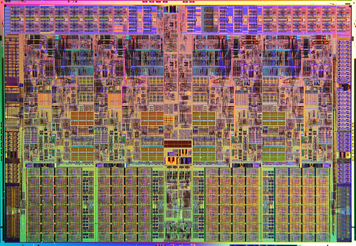
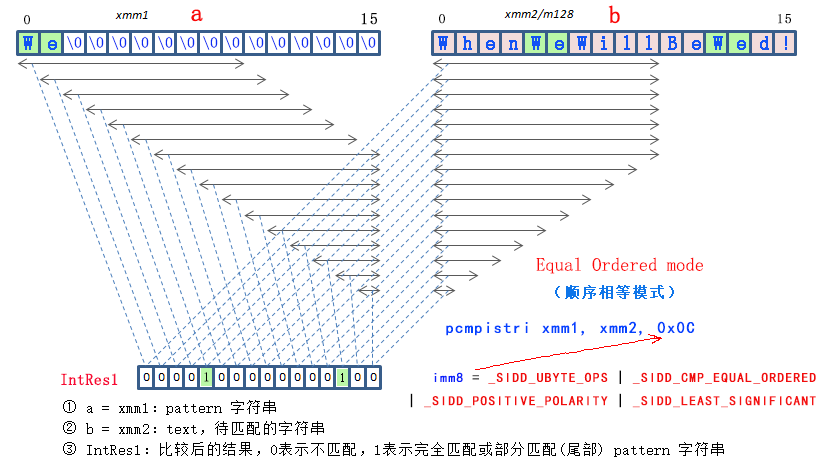

# 如何使用 SSE 4.2 的 PCMPxSTRx 指令

tags: "Intel", "SIMD", "SSE 4.2", "PCMPxSTRx", "PCMPISTRI", "PCMPISTRM", "字符串匹配", "String Match"

## 1. SIMD 简介

现代的 `CPU` 大多都提供了 [`单指令流多数据流`](https://zh.wikipedia.org/wiki/%E5%8D%95%E6%8C%87%E4%BB%A4%E6%B5%81%E5%A4%9A%E6%95%B0%E6%8D%AE%E6%B5%81)（`SIMD`，`Single Instruction Multiple Data`）指令集，最常见的是用于大量的浮点数计算。但其实也可以用在文字处理方面，`Intel` 在 `SSE 4.2` 指令集中就加入了字符串处理的指令，这就是 `PCMPxSTRx` 系列指令。

这里简单的介绍一下 `x86` 架构下的 `SIMD`，在 `SSE 4.2` 指令集之前，`Intel` 和 `AMD` 共同维护和开发了 `MMX`，`SSE`，`SSE 2`，`SSE 3`，`SSE 4`，`SSE 4.1`，`SSE 4.a`，`3D Now` 等指令集。在 `SSE 4.2` 指令集之后，最新的还有 `SSE 5`，`AVX`，`AVX 2`，`FMA`，`AVX 512` 等等。



（配图为 `2008` 年发售的 `Intel Core i7` 芯片，它采用的 `Nehalem` 架构是第一个支持 `SSE 4.2` 的微架构。）

## 2. SSE 4.2 指令集

`SSE 4.2` 指令集都包含了哪些指令？

这里也简单介绍一下，通过 `Intel` 官方网站的指令指南：[Intel Intrinsics Guide: SSE 4.2](https://software.intel.com/sites/landingpage/IntrinsicsGuide/#expand=914&techs=SSE4_2)，可以看到。

`SSE 4.2` 指令集主要包含了三类指令：

* 用于字符或文字处理的 `PCMPxSTRx` 系列指令
* 用于校验或者哈希的 `CRC32` 系列指令
* 用于批量的 `64位` 数据比较的 `_mm_cmpgt_epi64()` 指令（这个是填以前的坑的，因为 `SSE 4.2` 之前没实现）

忽略第 `3` 类那条填旧坑的指令（而且也只有一条而已），`SSE 4.2` 其实只有 `PCMPxSTRx` 和 `CRC32` 两大类，其中绝大部分都是 `PCMPxSTRx` 指令。所以，如果你认为 `PCMPxSTRx` 就是 `SSE 4.2` 指令集的代表，也不为过。

下图中，以 `_mm_cmpestr` 和 `_mm_cmpistr` 开头的函数都是 `PCMPxSTRx` 指令。

（注：为了编程方便，`Intel` 把指令包装成函数，这些函数“一一对应”着某一条具体的 `CPU` 指令。）


## 3. PCMPxSTRx 指令

### 3.1 原理

`PCMPxSTRx` 系列指令有着很强的 `并行比较` 能力，也许是 `x86` 指令集中最复杂的指令之一。

那么，`PCMPxSTRx` 指令到底能干什么？工作原理？

它可以一次对一组字符（16个Bytes或8个Word）与另一组字符（16个Bytes或8个Word）同时作比较，也就是说这一条指令一次可以最多做 "`16 × 16 = 256`" 次的 `字符` 比较。虽然它没有采取任何优化算法，但是由于硬件指令的暴力并行，还是能对字符串匹配、搜索和比较的性能产生巨大的提升。

我们以最常用、最有价值的 `Equal Ordered`（顺序相等）模式为例，大致的工作原理如下所示：



上图所示指令的 `C/C++` 伪代码如下：

```c
char * operand1 = "We";
char * operand2 = "WhenWeWillBeWed!"

// imm8 = 0x0C
uint8_t imm8 = _SIDD_CHAR_OPS | _SIDD_CMP_EQUAL_ORDERED
    | _SIDD_POSITIVE_POLARITY | _SIDD_LEAST_SIGNIFICANT;

// pcmpistri  xmm1, xmm2, 0x0C
int index = _mm_cmpistri(operand1, operand2, imm8);
```

详细分析：

* `Equal Ordered` = 0x0C，imm[3:2] = 11b，判断 `operand1` 是否是 `operand2` 的子串。

```c
operand2 = "WhenWeWillBeWed!"
operand1 = "We"
IntRes1  =  0000100000001000 (b)
index    =  4 (从左边最低位开始数，第一个 "1" 的索引值是 4 ，索引从 0 开始计数)
```

我们可以看到 `"WhenWeWillBeWed!"` 中包含了 `"We"` 子串两次，分别是在索引 `4` 和 `12` 的位置（`IntRes1` 从左往右数），由于我们指定了 `_SIDD_LEAST_SIGNIFICANT` 参数，即 `LSB` (`Least Significant Bit`，最低有效位)，所以从左边最低位开始数，第一个为 `"1"` 的 `bit` 的索引值是 `4` ，索引从 `0` 开始计数。

注：在上面的例子中，`IntRes1` 是一个 16 个 `bit` 整形。

### 3.2 指令详解

`PCMPxSTRx` 指令其实是一个指令系列的统称，其中 `x` 代表通配符，它包含了下面的四条具体指令：

* pcmp[**e**](https://baidu.com)str[**i**](https://baidu.com)：**P**acked **Com**pare **E**xplicit Length **Str**ings, Return **I**ndex。<br/>-------------（批量比较显式指定长度的字符串，返回索引值）

* pcmp[**e**](https://baidu.com)str[**m**](https://baidu.com)：**P**acked **Com**pare **E**xplicit Length **Str**ings, Return **M**ask。<br/>-------------（批量比较显式指定长度的字符串，返回掩码）

* pcmp[**i**](https://baidu.com)str[**i**](https://baidu.com)：**P**acked **Com**pare **I**mplicit Length **Str**ings, Return **I**ndex。<br/>-------------（批量比较隐式长度的字符串，返回索引值）

* pcmp[**i**](https://baidu.com)str[**m**](https://baidu.com)：**P**acked **Com**pare **I**mplicit Length **Str**ings, Return **M**ask。<br/>-------------（批量比较隐式长度的字符串，返回掩码）

为了方便理解，先来了解一下 `PCMPxSTRx` 指令的一般格式，例如：

```asm
pcmpistri  arg1, arg2, imm8
```

注：其中 `arg1`，`arg2` 可以是任意的 `SSE 128位` 寄存器 `xmm0` ~ `xmm15`（一共 16 个），`imm8` 是一个 `8bit` 的立即数（常量），用于配置 `pcmpistri` 指令，定义指令具体的执行功能，稍后会详细介绍。常用的值是：imm8 = 0x0C（十六进制）。

那么，这四条指令有什么区别？请看下表，有更清晰的划分：

|                                                                                    |      返回索引<br/>(返回匹配字符串的<br/>索引值到 %ecx)      |   返回Mask<br/>(返回字符比较结果的<br/>bitmask 到 %xmm0)    |
| :--------------------------------------------------------------------------------: | :---------------------------------------------------------: | :---------------------------------------------------------: |
| 显式的指定字符串的长度，<br/>arg1 的长度保存在 %edx，<br/>arg2 的长度保存在 %eax。 | pcmp[**e**](https://baidu.com)str[**i**](https://baidu.com) | pcmp[**e**](https://baidu.com)str[**m**](https://baidu.com) |
|                   隐式的字符串长度，<br/>以字符串终止符'\0'结束                    | pcmp[**i**](https://baidu.com)str[**i**](https://baidu.com) | pcmp[**i**](https://baidu.com)str[**m**](https://baidu.com) |

从上表可以看出，在 `PCMPxSTRx` 指令中，

前面的通配符：

* 如果是 `e` 的话，表示显示的指定输入的字符串的长度，`arg1` 的长度保存在 `%edx` 寄存器，`arg2` 的长度保存在 `%eax` 寄存器。

* 如果是 `i`，则表示隐式的字符串长度，输入的字符串以终止符 “`\0`” 结束。

后面的通配符：

* 如果是 `i`，则表示返回的结果是索引值，即 `IntRes1` 中（二进制）从最高位开始数 (MSB) 或最低位开始数 (LSB) 第一个为 `1` 的索引位置，结果存到 `%ecx` 寄存器。

* 如果是 `m`，则表示返回的结果是一个 `BitMask` (Bit位或Byte位掩码)，且这个值保存到 `%xmm0` 寄存器中。

注：在 `PCMPxSTRx` 指令的 `AVX` 版 `VPCMPxSTRx` 指令中，前面提到的 `%eax`，`%edx` 寄存器相对应的要换成 `%rax`，`%rdx` 寄存器，而 `%ecx` 寄存器做为返回的索引值，即使在 `AVX` 版下也足够了，所以不变。

## X. 附录

### X.1 访问条件码指令

| 指令    | 同义名 | 效果                | 设置条件             |
| :------ | :----- | :------------------ | :------------------- |
| sete D  | setz   | D = ZF              | 相等/零              |
| setne D | setnz  | D = ~ZF             | 不等/非零            |
| sets D  |        | D = SF              | 负数                 |
| setns D |        | D = ~SF             | 非负数               |
| setg D  | setnle | D = ~(SF ^OF) & ZF  | 大于(有符号>)        |
| setge D | setnl  | D = ~(SF ^OF)       | 小于等于(有符号>=)   |
| setl D  | setnge | D = SF ^ OF         | 小于(有符号<)        |
| setle D | setng  | D = (SF ^ OF) \| ZF | 小于等于(有符号<=)   |
| seta D  | setnbe | D = ~CF & ~ZF       | 超过(无符号>)        |
| setae D | setnb  | D = ~CF             | 超过或等于(无符号>=) |
| setb D  | setnae | D = CF              | 低于(无符号<)        |
| setbe D | setna  | D = CF \| ZF        | 低于或等于(无符号<=) |

### X.2 跳转指令

| 指令         | 同义名   | 跳转条件         | 描述                 |
| :----------- | :------- | :--------------- | :------------------- |
| jmp          |          | 1                | 直接跳转             |
| jmp *Operand |          | 1                | 间接跳转             |
| jz           | je       | ZF               | 等于/零              |
| jnz          | jne      | ~ZF              | 不等于/非零          |
| js           |          | SF               | 符号位为 "1"，负数   |
| jns          |          | ~SF              | 符号位为 "0"，非负数 |
| jg           | jnle     | ~(SF ^ OF) & ~ZF | 大于(有符号>)        |
| jge          | jnl      | ~(SF ^ OF)       | 大于等于(有符号>=)   |
| jl           | jnge     | SF ^ OF          | 小于(有符号<)        |
| jle          | jng      | (SF ^ OF) \| ZF  | 小于等于(有符号<=)   |
| ja           | jnbe     | ~CF & ~ZF        | 超过(无符号>)        |
| jae          | jnb      | ~CF              | 超过或等于(无符号>=) |
| jb           | jnae     | CF               | 低于(无符号<)        |
| jbe          | jna      | CF \| ZF         | 低于或等于(无符号<=) |
| jc           | jb, jnae | CF               | 低于(无符号<)        |
| jnc          | ja, jnbe | ~CF              | 超过或等于(无符号>=) |
| jo           |          | OF               | 溢出                 |
| jno          |          | ~OF              | 不溢出               |
| jp           | jpe      |                  | 奇偶性为偶数时       |
| jnp          | jnpe     |                  | 奇偶性为奇数时       |

## X. 参考文章

* 【1】: [RapidJSON 代码剖析（二）：使用 SSE 4.2 优化字符串扫描](https://zhuanlan.zhihu.com/p/20037058)
* 【2】: [Implementing strcmp, strlen, and strstr using SSE 4.2 instructions](https://www.strchr.com/strcmp_and_strlen_using_sse_4.2)
* 【3】: [sse 4.2带来的优化](https://www.zzsec.org/2013/08/using-sse_4.2/)
* 【4】: [Intel: Intrinsics Guide](https://software.intel.com/sites/landingpage/IntrinsicsGuide/)
* 【5】: [x86: PCMPISTRI](https://www.felixcloutier.com/x86/pcmpistri)
* 【6】: [HJLebbink: /asm-dude/wiki/PCMPISTRI](https://github.com/HJLebbink/asm-dude/wiki/PCMPISTRI)
* 【7】: [x86 汇编指令详解](https://blog.csdn.net/zhu2695/article/details/16812415)
