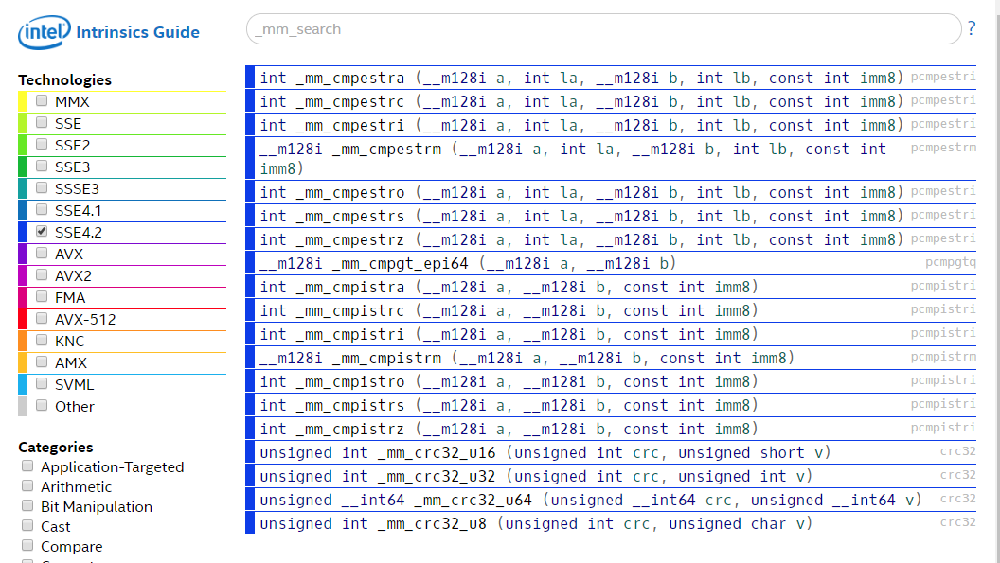

# 如何使用 SSE 4.2 的 PCMPxSTRx 指令

tags: "Intel", "SIMD", "SSE 4.2", "PCMPxSTRx", "PCMPISTRI", "PCMPISTRM", "字符串匹配", "String Match"

## 1. SIMD 简介

现代的 `CPU` 大多都提供了 [`单指令流多数据流`](https://zh.wikipedia.org/wiki/%E5%8D%95%E6%8C%87%E4%BB%A4%E6%B5%81%E5%A4%9A%E6%95%B0%E6%8D%AE%E6%B5%81)（`SIMD`，`Single Instruction Multiple Data`）指令集，最常见的是用于大量的浮点数计算。但其实也可以用在文字处理方面，`Intel` 在 `SSE 4.2` 指令集中就加入了字符串处理的指令，这就是 `PCMPxSTRx` 系列指令。

这里简单的介绍一下 `x86` 架构下的 `SIMD`，在 `SSE 4.2` 指令集之前，`Intel` 和 `AMD` 共同维护和开发了 `MMX`，`SSE`，`SSE 2`，`SSE 3`，`SSE 4`，`SSE 4.1`，`SSE 4.a`，`3D Now` 等指令集。在 `SSE 4.2` 指令集之后，最新的还有 `SSE 5`，`AVX`，`AVX 2`，`FMA`，`AVX 512` 等等指令集。


（配图为 `2008` 年发售的 `Intel Core i7` 芯片，它采用的 `Nehalem` 是第一个支持 `SSE 4.2` 的微架构。）

## 2. SSE 4.2 指令集

`SSE 4.2` 指令集都包含了哪些指令？

这里也简单介绍一下，通过 `Intel` 官方网站的指令指南：[Intel: Intrinsics Guide](https://software.intel.com/sites/landingpage/IntrinsicsGuide/#expand=914&techs=SSE4_2)，我们可以看到：

`SSE 4.2` 指令集主要包含了三类指令：

* 用于字符或文字处理的 `PCMPxSTRx` 系列指令
* 用于校验或者哈希的 `CRC32` 系列指令
* 用于 packed 的 `64位` 数据比较的 `_mm_cmpgt_epi64()` 指令（这个是填以前的坑的，因为 `SSE 4.2` 之前没实现）

忽略第 `3` 类那个填旧坑的指令（而且也只有一条而已），其实 `SSE 4.2` 只有 `PCMPxSTRx` 和 `CRC32` 两大类指令，其中绝大部分都是 `PCMPxSTRx` 指令，所以，你如果认为 `PCMPxSTRx` 就是 `SSE 4.2` 指令集的代表，也不为过。

如下图所示，图中以 `_mm_cmpestr` 和 `_mm_cmpistr` 开头的函数都是 `PCMPxSTRx` 指令。

（注：为了编程方便，`Intel` 把指令包装成函数，这些函数“一一对应”着某一条具体的 `CPU` 指令。）



## 3. PCMPxSTRx 指令

### 3.1 原理

那么，什么是 `PCMPxSTRx` 指令？它能干什么？

`PCMPxSTRx` 系列指令有着很强的 `并行比较` 能力，也许是 `x86` 指令集里最复杂的指令之一。

它可以一次对一组字符（16个Bytes或8个Word）与另一组字符（16个Bytes或8个Word）同时作比较，也就是说这一条指令一次可以最多做 "`16 × 16 = 256`" 次的 `字符` 比较。虽然它没有采取任何优化算法，但是由于硬件指令的暴力并行，还是能对字符串匹配、搜索和比较的性能产生巨大的提升。

我们以最常用、最有价值的 `Equal Ordered`（顺序相等）模式为例，大致的工作原理如下所示：


### 3.2 指令详解

`PCMPxSTRx` 指令其实是一个指令系列的统称，其中 `x` 代表通配符，它包含了下面的四条具体指令：

PCMP[**E**](https://baidu.com)STR[**I**](https://baidu.com)，PCMP[**E**](https://baidu.com)STR[**M**](https://baidu.com)，PCMP[**I**](https://baidu.com)STR[**I**](https://baidu.com)，PCMP[**I**](https://baidu.com)STR[**M**](https://baidu.com)

那么这四条指令分别是什么意思呢？请看下面的表：

|                                                                                    |       返回索引<br/>返回匹配字符串的<br/>索引值到 %rcx       |    返回Mask<br/>返回字符比较结果的<br/>bitmask 到 %xmm0     |
| :--------------------------------------------------------------------------------: | :---------------------------------------------------------: | :---------------------------------------------------------: |
| 显式的指定字符串的长度，<br/>xmm1 的长度保存在 %rdx，<br/>xmm2 的长度保存在 %rax。 | PCMP[**E**](https://baidu.com)STR[**I**](https://baidu.com) | PCMP[**E**](https://baidu.com)STR[**M**](https://baidu.com) |
|                     隐式的字符串长度，<br/>以字符串终止符结束                      | PCMP[**I**](https://baidu.com)STR[**I**](https://baidu.com) | PCMP[**I**](https://baidu.com)STR[**M**](https://baidu.com) |

为了方便说明，我们先来了解一下 `PCMPxSTRx` 指令的一般格式，例如：

```asm
PCMPISTRI    xmm1, xmm2, imm8
```

其中 `xmm1`, `xmm2` 代表任意的 `SSE` 的 `128位` 寄存器（`SSE` 一共有 `xmm0` ~ `xmm15` 个寄存器），`imm8` 是一个 `8bit` 的立即数（常量），用于配置 `PCMPISTRI` 指令，定义这条指令的具体行为，后面会详细介绍。例如：imm8 = 0x0C（十六进制）。

从上表可以看出，PCMP[**E**](https://baidu.com)STR[**I**](https://baidu.com) 中前面这个通配符如果是 `E` 的话，表示显示的指定输入的字符串的长度，`xmm1` 的长度由 `%rdx` 指定，`xmm2` 的长度由 `%rax` 指定。如果是 `I` 则表示隐式的字符串长度，输入的字符串以终止符 “`\0`” 结束。

## X. 参考文章

* [1]: [RapidJSON 代码剖析（二）：使用 SSE 4.2 优化字符串扫描](https://zhuanlan.zhihu.com/p/20037058)

* [2]: [Implementing strcmp, strlen, and strstr using SSE 4.2 instructions](https://www.strchr.com/strcmp_and_strlen_using_sse_4.2)

* [3]: [sse 4.2带来的优化](https://www.zzsec.org/2013/08/using-sse_4.2/)

